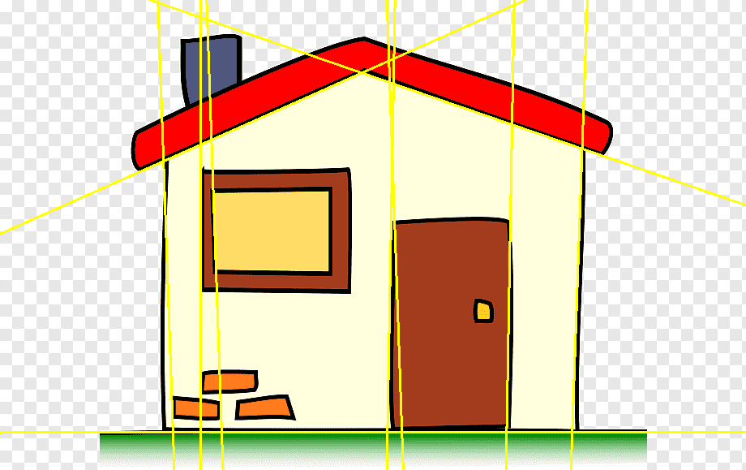
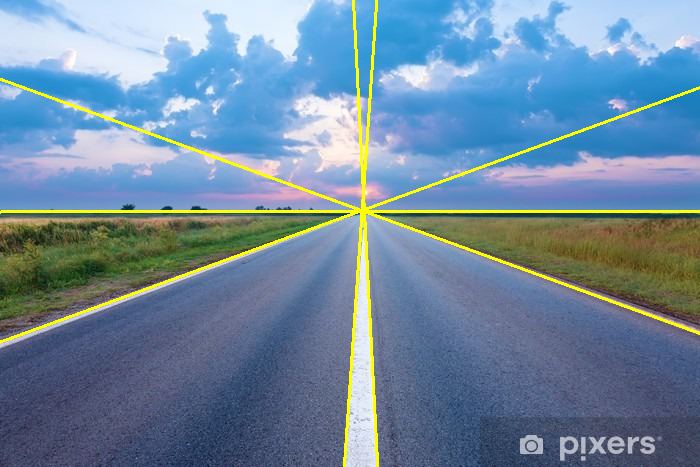
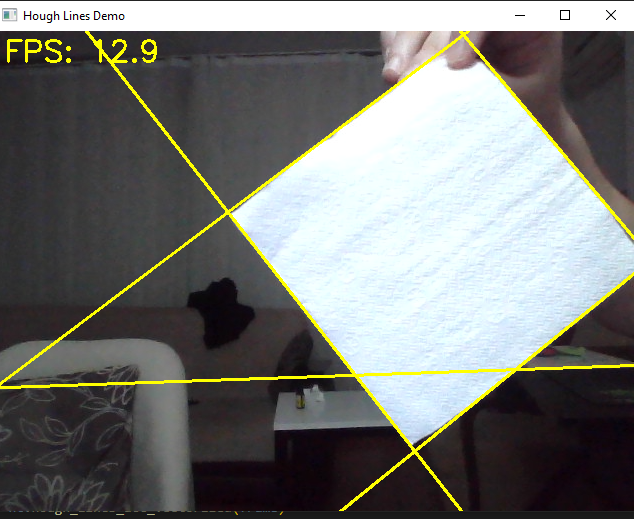
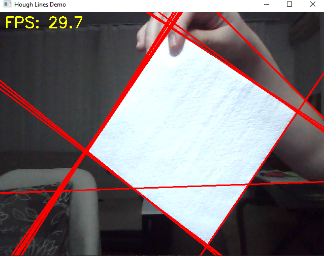

# hough-line-detection-fast

This project was developed as part of an undergraduate Computer Vision course to implement line detection using the Hough Transform from scratch. The key highlight of this implementation is its vectorized approach, ensuring high computational efficiency and significantly faster performance compared to traditional methods. Hope this helps somebody!

## Samples of Input and Output

Below is an example showing the input image and the corresponding output after applying the Hough Transform for line detection. It can be observed that whole lines are drawn instead of found line segment in image, this can be prevented by finding the segments' finishing points in the code.

| **Input Image**                          | **Output Image**                          |
|------------------------------------------|-------------------------------------------|
|          |         |
|        |       |
|       |      |

